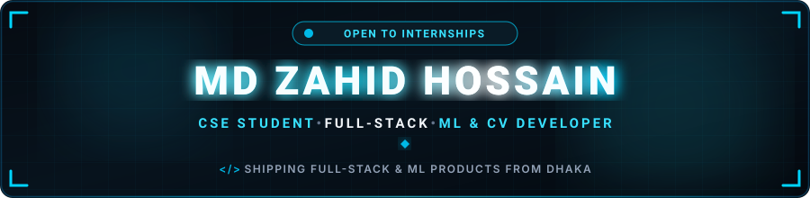

  

  

  
  &nbsp;
  
  &nbsp;
  
  &nbsp;
  

  
  &nbsp;
  

---

<h2 align="center">🔵 About Me</h2>

  Hey! I'm <b>Md Zahid Hossain</b>, a <b>CSE student at East West University</b> based in Dhaka, Bangladesh 🇧🇩 
  I build <b>full-stack web &amp; mobile products</b> and <b>ML / computer-vision systems</b> — from ride-sharing apps to AI-powered surveillance pipelines.

  
  &nbsp;
  
  &nbsp;
  
  &nbsp;
  

<table width="100%" border="0" align="center">
<tr>
<td width="50%" align="center" style="padding: 14px;">
  <h4>🎓 Education</h4>
  
<b>CSE, East West University</b> 8th Semester · Expected Dec 2027

</td>
<td width="50%" align="center" style="padding: 14px;">
  <h4>🔭 Currently Building</h4>
  
<a href="https://github.com/Sheikh-M-Zahid/UniRide_App"><b>UniRide</b></a> Smart ride-sharing app

</td>
</tr>
<tr>
<td width="50%" align="center" style="padding: 14px;">
  <h4>🌱 Learning</h4>
  
<b>Real-time systems</b> AI-powered recommendation engines

</td>
<td width="50%" align="center" style="padding: 14px;">
  <h4>⚡ Fuel</h4>
  
<b>Curiosity + strong coffee ☕</b> Open to collaboration

</td>
</tr>
</table>

---

<h2 align="center">🚀 Featured Project Spotlight</h2>

<table width="100%" border="0" align="center">
<tr>
<td align="center" style="padding: 22px;">
  <h3>🚗 UniRide</h3>
  
<i>Full-stack ride-sharing platform with smart multi-seat matching, real-time tracking, and an AI-driven ride recommendation engine.</i>

  

    
    
    
    
    
    
  

  
CBF + Contextual Bandit recommendation · Live tracking · WebRTC calling · Promo/offer system

  

    
  

</td>
</tr>
</table>

---

<h2 align="center">🔬 More Projects</h2>

<table width="100%" align="center">
<tr>
<td width="50%" valign="top" style="padding: 14px;">
  <h4>🌾 Smart Agri-Advisory Platform</h4>
  
AI-powered advisory platform for farmers, extension officers, and suppliers.

  

    <code>Laravel 11</code> · <code>Flask</code> · <code>PyTorch / CNN</code> · <code>Supabase PostgreSQL</code> · <code>Azure App Service</code>
  

  
Crop &amp; fertilizer recommendation, price forecasting, and CNN pest detection trained on PlantVillage (42k images, 38 classes).

  
<a href="https://github.com/Marjan15H/Agri_Advisory">🔗 Repository</a>

</td>
<td width="50%" valign="top" style="padding: 14px;">
  <h4>🚦 Smart Traffic Management &amp; AI Surveillance</h4>
  
Enterprise-grade traffic monitoring with vehicle tracking, speed estimation, and ANPR.

  

    <code>YOLOv8/v10</code> · <code>ByteTrack</code> · <code>PaddleOCR / EasyOCR</code> · <code>FastAPI</code>
  

  
Homography-based speed estimation, colour-coded violation detection, ANPR on overspeeding vehicles, traffic density heatmap.

  
🔄 <b>In Development</b>

</td>
</tr>
<tr>
<td width="50%" valign="top" style="padding: 14px;">
  <h4>⚽ Football Live Matchday</h4>
  
Live football notification app with match reminders and lineup alerts.

  

    <code>Node.js / Express</code> · <code>React / Vite</code> · <code>Neon PostgreSQL</code>
  

  
3-stage email notifications (24h / 2h / lineup), live favourite-club ticker, football-data.org API.

  
<a href="https://github.com/Zahid074/football-live-matchday">🔗 Repository</a>

</td>
<td width="50%" valign="top" style="padding: 14px;">
  <h4>⌨️ SpeedType</h4>
  
Vanilla JS typing trainer with ghost race mode and live stats.

  

    <code>HTML</code> · <code>CSS</code> · <code>JavaScript</code>
  

  
Dark/light theme, ghost race mode, WPM trend chart, streaks, and leaderboard.

  
<a href="https://github.com/Zahid074/speedtype">🔗 Repository</a>

</td>
</tr>
</table>

---

<h2 align="center">🛠️ Tech Stack &amp; Skills</h2>

<b>Languages</b>

  

<b>Frontend &amp; Mobile</b>

  

<b>Backend &amp; APIs</b>

  

<b>Data, Cloud &amp; DevOps</b>

  

<b>AI / ML / Computer Vision</b>

  
   
  
  &nbsp;
  
  &nbsp;
  

---

<h2 align="center">📊 GitHub Analytics &amp; Activity</h2>

  
  &nbsp;&nbsp;
  

  

---

<h2 align="center">⚡ Contribution Journey</h2>

<!-- Snake needs the workflow in .github/workflows/snake.yml to run successfully at least once -->

  <picture>
    <source media="(prefers-color-scheme: dark)" srcset="https://raw.githubusercontent.com/Zahid074/Zahid074/output/github-snake-dark.svg" />
    <source media="(prefers-color-scheme: light)" srcset="https://raw.githubusercontent.com/Zahid074/Zahid074/output/github-snake.svg" />
    
  </picture>

---

<h2 align="center">📬 Let's Connect &amp; Collaborate</h2>

<i>Open to <b>internships</b>, <b>freelance full-stack work</b>, and <b>collaborative projects</b> — let's build something great together!</i>

<table border="0" align="center">
<tr>
<td align="center" width="220" style="padding: 16px;">
  <a href="https://www.linkedin.com/in/md-zahid-hossain-1806022b0" target="_blank">
    
      
    
  </a>
   
  <b>Professional Network</b>
</td>
<td align="center" width="220" style="padding: 16px;">
  <a href="https://www.kaggle.com/mohammadzahidhossain" target="_blank">
    <h1>📊</h1>
    
  </a>
   
  <b>Data Science &amp; ML</b>
</td>
<td align="center" width="220" style="padding: 16px;">
  <a href="http://zahid-protfolio.netlify.app" target="_blank">
    
      
    
  </a>
   
  <b>Projects &amp; Work</b>
</td>
</tr>
</table>

  

